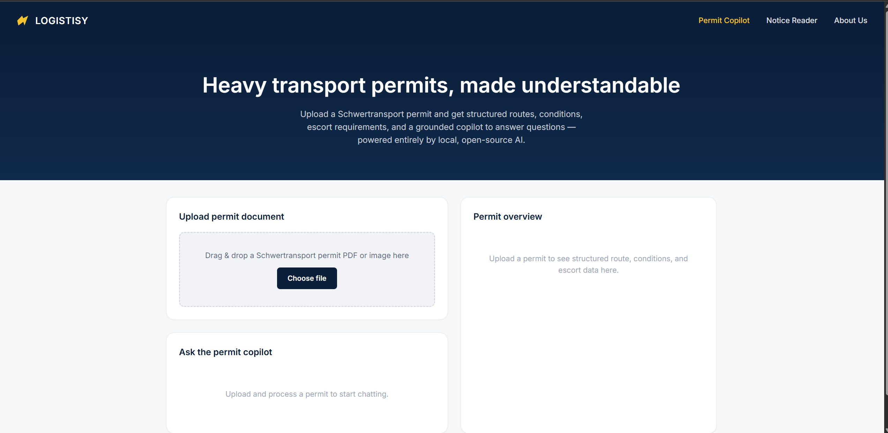
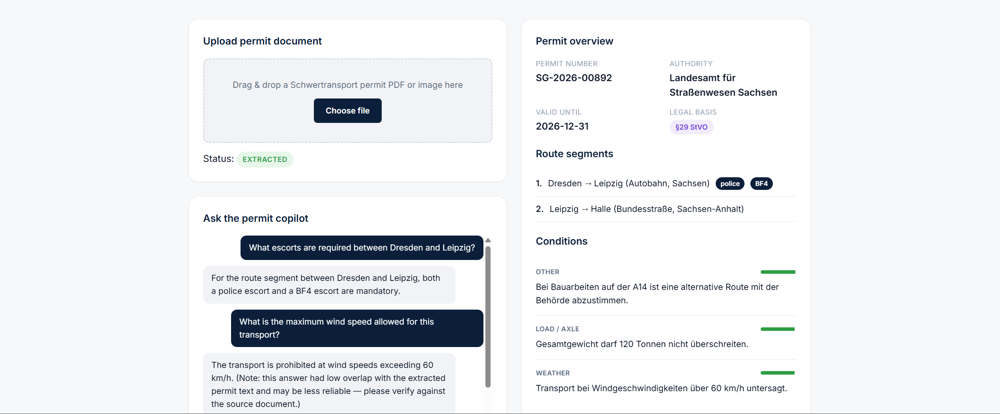

# Logistisy Permit Copilot (MVP)

**Live app:** [https://logistisy-permit-copilot-mvp-production.up.railway.app/](https://logistisy-permit-copilot-mvp-production.up.railway.app/)



AI-assisted workspace that turns heavy-transport (Schwertransport) permit documents into
structured, actionable data - route restrictions, escort requirements, time windows, and
a grounded chat assistant that answers questions using only the permit's own text.

Runs on **Google Gemini** for vision-based extraction and grounded chat, with a
multi-key/multi-model ensemble strategy to stay resilient on the free tier.
Styled after logistisy.com (navy + gold).

Sample Permit PDF there in the repository for test purposes!

## Stack

- **Frontend:** React + TypeScript + Vite
- **Backend:** FastAPI (Python)
- **Database:** PostgreSQL
- **Queue/cache:** Redis
- **AI:**
  - **Gemini 2.0/2.5 Flash** — reads the permit image/PDF page directly and
    extracts structured JSON in a single call (OCR + extraction combined)
  - **Gemini 2.0/2.5 Flash** — grounded Q&A over the extracted permit text
  - **Ensemble fallback:** rotates across multiple API keys and model variants
    (e.g. `gemini-2.5-flash` → `gemini-2.0-flash` → `gemini-1.5-flash`) when a
    free-tier rate limit (HTTP 429) is hit, instead of the request failing outright
- **Infra:** Docker Compose (one command to run everything)

## Why Gemini, and why an ensemble

Benchmarked document-to-JSON extraction accuracy across Gemini, Gemma 3, and
Qwen2.5-VL showed Gemini delivering the highest raw accuracy of the models
evaluated, with reliable single-call OCR + structured extraction and strong
instruction-following on JSON schemas. The tradeoff is that Gemini's free tier
enforces strict per-minute and per-day rate limits, which is a real risk during a
live demo or bursty upload traffic.

To work around this without paying for a higher tier, the backend uses an
**ensemble/fallback client**: it holds a pool of API keys and model variants,
and on a 429 (rate limited) or 503 (overloaded) response, it automatically retries
against the next key/model in the pool with exponential backoff, rather than
surfacing an error to the user. Full rationale in `SYSTEM_DESIGN.md`.



## Architecture

```
frontend (React) --> backend (FastAPI) --> Postgres
                             |--> Redis (job status)
                             |--> Gemini ensemble (extraction: vision)
                             |--> Gemini ensemble (grounded chat: text)
```

## Project Structure

```
logistisy-permit-copilot/
├── backend/
│   ├── app/
│   │   ├── main.py
│   │   ├── config.py
│   │   ├── database.py
│   │   ├── models.py
│   │   ├── schemas.py
│   │   ├── routers/
│   │   │   ├── documents.py
│   │   │   ├── permits.py
│   │   │   └── chat.py
│   │   └── services/
│   │       ├── ocr_service.py        # file validation + checksum dedup
│   │       ├── extraction_service.py # orchestrates Gemini extraction -> DB
│   │       └── llm_client.py         # Gemini ensemble client (multi-key/model fallback)
│   ├── requirements.txt
│   ├── Dockerfile
│   └── .env.example
├── frontend/
│   └── src/ (components, api client, theme.css)
├── docker-compose.yml   # includes db, redis, backend, frontend
└── SYSTEM_DESIGN.md
```

## Running locally

```bash
cp backend/.env.example backend/.env
# Add one or more Gemini API keys to .env, comma-separated:
# GEMINI_API_KEYS=key1,key2,key3
# GEMINI_MODEL_POOL=gemini-2.5-flash,gemini-2.0-flash,gemini-1.5-flash

docker compose up --build
```

- Frontend: http://localhost:5173
- Backend API docs: http://localhost:8000/docs

## Core flow

1. Upload a permit PDF/image → `POST /documents`
2. Gemini reads the image and extracts structured data in one call, via the
   ensemble client (auto-rotates keys/models on rate limit)
3. Dashboard shows structured conditions, route segments, escort requirements,
   confidence scores
4. Ask the copilot questions — Gemini answers are grounded strictly in the
   permit's own extracted text

See `SYSTEM_DESIGN.md` for a full flowchart of this pipeline.

## Edge cases handled (see SYSTEM_DESIGN.md)

- Duplicate upload detection (checksum)
- Unsupported/empty file rejection
- Low-confidence fields flagged for human review
- Expired permit detection
- Multiple legal bases per permit
- Hallucination containment in chat ("not specified in this permit")
- Gemini rate-limited (429) → ensemble rotates key/model instead of failing
- All ensemble members exhausted → deterministic fallback instead of a crash
- Malformed LLM JSON output → defensive parsing strips markdown fences

## Next steps beyond MVP

- Multi-page PDF splitting and per-page extraction merge
- Auth (JWT) + multi-tenant scoping
- Background job queue (Celery/RQ) instead of synchronous processing
- Multi-Bundesland cross-permit validation
- Streaming Gemini responses for better perceived latency
- Paid-tier Gemini quota once usage outgrows free-tier ensemble capacity
